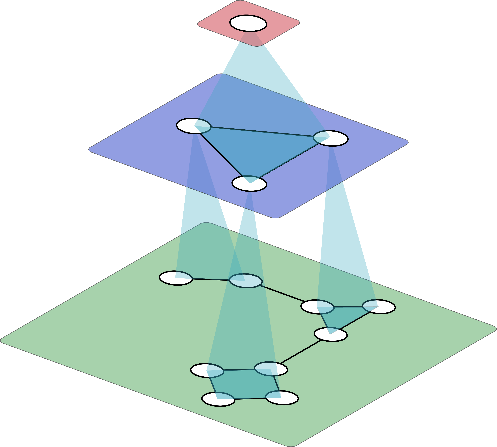
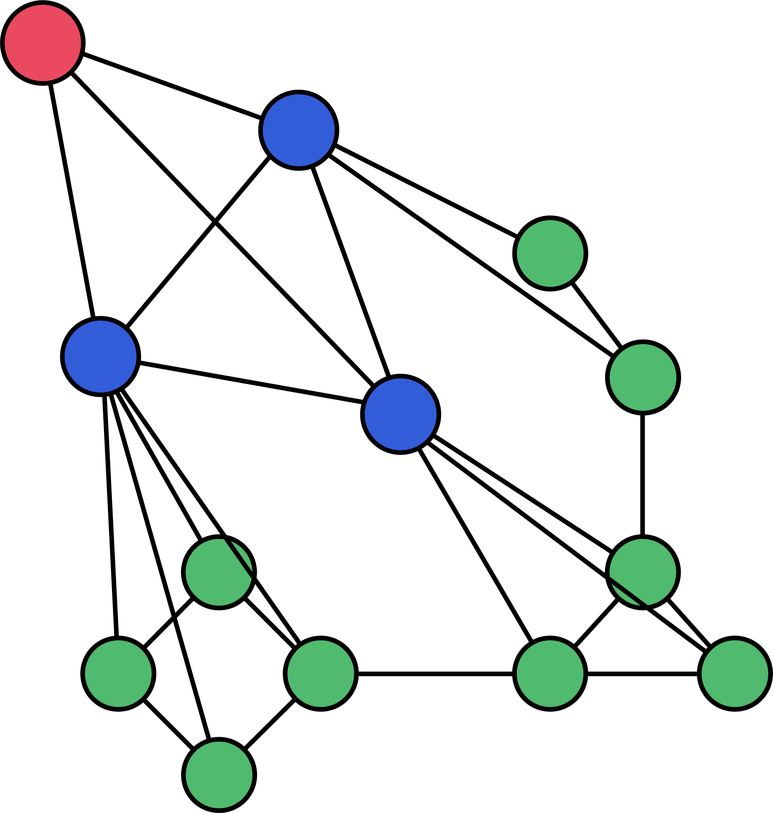

# Next Level Message-Passing with Hierarchical Support Graphs


<!--  -->

This is the repository of the paper [Next Level Message-Passing with Hierarchical Support Graphs]().
The code is based on the [GraphGPS repository](https://github.com/rampasek/GraphGPS).


<p align="center">
  
   
</p>

### Python environment setup with Conda

```bash
conda create -n graphgps python=3.10
conda activate graphgps

conda install pytorch torchvision torchaudio pytorch-cuda=11.7 -c pytorch -c nvidia
pip install torch_geometric==2.3.0
pip install pyg_lib torch_scatter torch_sparse torch_cluster torch_spline_conv -f https://data.pyg.org/whl/torch-2.0.0+cu117.html

# RDKit is required for OGB-LSC PCQM4Mv2 and datasets derived from it.  
conda install openbabel fsspec rdkit -c conda-forge

pip install pytorch-lightning yacs torchmetrics
pip install performer-pytorch
pip install tensorboardX
pip install ogb
pip install wandb

conda clean --all
```

To coarsen graphs using METIS one needs to install it separately, a good tutorial can be found [here](https://medium.com/@beppe2hd/a-simple-guide-to-set-up-pyg-with-metis-support-on-mac-and-linux-378e833d4de3).
Depending on your OS you might need to additionally set the following environment variables with your specific paths:
```bash	
export CPLUS_INCLUDE_PATH=/path/to/metis/include
export LIBRARY_PATH=/path/to/metis/lib
export LD_LIBRARY_PATH=/path/to/metis/lib
```

### Example use

```bash

python main.py --cfg configs/pept-struct_gatedgcn.yaml

```